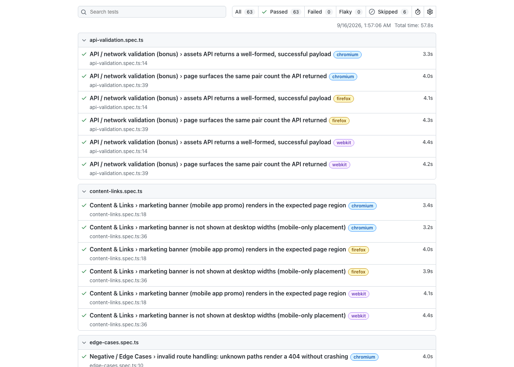

# MultiBank Trade QA — Playwright Automation Framework

Automated test suite for [trade.mb.io](https://trade.mb.io/), built for the MultiBank QA Automation coding challenge, plus the written QA strategy for Task 2.

**Result:** 21 automated tests × 3 browsers = 63 test runs, **0 failures, 0 flaky**, 2 scenarios explicitly documented as unreachable without authentication (see [Assumptions](#assumptions--adaptations)). Full evidence: [`docs/sample-report`](./docs/sample-report/index.html).

## Quick start

```bash
npm install
npx playwright install --with-deps
npm test
```

That's the single command: `npm test` runs the full suite (23 tests, 2 intentionally `fixme`) against `https://trade.mb.io` across Chromium, Firefox, and WebKit, and writes an HTML report to `playwright-report/`.

```bash
npm run report          # open the last HTML report
npm run test:chromium   # single browser, faster iteration
npm run test:crossbrowser  # explicit chromium+firefox+webkit run
npm run test:headed     # watch it run
npm run test:ui         # Playwright's interactive UI mode
npm run typecheck       # tsc --noEmit
```

No environment variables or secrets are required — every test runs against the public, unauthenticated surface of the app. `BASE_URL` can be overridden to point at a different environment if needed.

## What's covered

| Brief requirement | Status | Where |
|---|---|---|
| Top nav renders with all items visible | ✅ | `tests/navigation-layout.spec.ts` |
| Each nav item links to correct destination | ✅ | `tests/navigation-layout.spec.ts` |
| Nav behaves correctly at desktop viewports | ✅ (1280/1440/1920) | `tests/navigation-layout.spec.ts` |
| Spot trading section renders trading pairs | ✅ | `tests/trading-functionality.spec.ts` |
| Pairs grouped into categories | ✅ | `tests/trading-functionality.spec.ts` |
| Pair entries contain expected data fields | ✅ | `tests/trading-functionality.spec.ts` |
| Marketing banners render in expected region | ✅ | `tests/content-links.spec.ts` |
| App Store / Google Play links resolve | ⚠️ documented `fixme` | `tests/content-links.spec.ts` — see below |
| About Us > Why MultiBank page | ⚠️ documented `fixme` | `tests/content-links.spec.ts` — see below |
| Invalid route handling | ✅ | `tests/edge-cases.spec.ts` |
| Broken link detection | ✅ | `tests/edge-cases.spec.ts` |
| Mobile viewport regression | ✅ | `tests/edge-cases.spec.ts` |
| Content loading timeout handling | ✅ | `tests/edge-cases.spec.ts` |
| Bonus: API/network validation | ✅ | `tests/api-validation.spec.ts` |
| Bonus: parameterized test data | ✅ | `src/data/navigation.data.ts` drives both nav and edge-case specs |
| Bonus: CI | ✅ | `.github/workflows/playwright.yml` |
| Bonus: visual regression | ❌ not attempted | see [Known gaps](#known-gaps--future-work) |

## Assumptions & Adaptations

The brief states trade.mb.io is "completable without logging in." That was true when the brief was written, but **the live site currently redirects its homepage (`/`) and every trading/exploration route (`/trade/*`, `/explore/*`, `/price/*`) to `/login`** for anonymous visitors. This was verified directly, not assumed:

- `https://trade.mb.io/` → 200 response, final URL `https://trade.mb.io/login?next=%2F`.
- `/en`, `/trade/BTC_USD`, `/explore/*`, `/price/BTC` — all redirect the same way, confirmed with a fresh, cookie-less browser context each time.
- `robots.txt` and the sitemap still list these as public/indexable routes, and the app's own bundled i18n dictionary contains the exact section keys the brief describes — `about-us`, `why-multibank`, `spot-exchange`, `trade-on-the-go` / `app-store` / `google-play` — confirming this content exists in the product, just behind a login wall that wasn't there when the brief was authored.
- `/markets` is the one page that renders the full header and a real spot-market listing (28 pairs, sortable into Favorites/All/Top Gainers/Top Losers/Top Volume, backed by a same-origin API) **without** authentication.

Given the brief's explicit instruction not to create accounts or log in, the suite was scoped as follows rather than shipped with guessed selectors against content nobody can currently verify:

1. **Navigation & Layout, Trading Functionality** — tested in full against `/markets`, which is the real, public "spot trading section." This is a documented interpretation, not a guess: it's the only page matching the brief's description that an anonymous user can actually reach.
2. **Marketing banners** — the brief's example (App Store/Play Store promo) does have one real, public instance: a mobile-only "Open the mb.io App" banner rendered inside the header on `/markets`. It's fully tested (region, content, desktop-absence).
3. **App Store/Google Play direct links, and About Us > Why MultiBank** — confirmed to exist only inside the gated homepage template. Rather than fake these against unverifiable selectors, they're implemented as `test.fixme(...)` calls with the investigation trail recorded inline in `tests/content-links.spec.ts`, so they show up clearly in every report as "known, explained gap" rather than a silent omission.
4. **Gated nav items ("Home", "Trade" > "Spot")** — still tested, but the assertion is that an anonymous user is correctly redirected to `/login` with the intended path preserved in `?next=`. That redirect behaviour is itself the correct, testable contract for an anonymous visitor.

This is deliberate: an assessment about "awareness of real-world failure modes" and "meaningful, resilient assertions" is better served by a suite that's honest about what it can verify than one that asserts against content it never actually saw render.

## Architecture

```
src/
  pages/          Page Objects (BasePage, MarketsPage)
  components/     Shared UI chrome as components, not pages (HeaderComponent)
  data/           Parameterized test data (nav items, trade menu, auth entry points)
tests/
  navigation-layout.spec.ts
  trading-functionality.spec.ts
  content-links.spec.ts
  edge-cases.spec.ts
  api-validation.spec.ts
docs/
  TASK2_QA_STRATEGY.docx
  TEST_PLAN.docx
  RELEASE_READINESS_CHECKLIST.docx
  RISK_MATRIX.docx
  sample-report/        committed HTML/PDF execution report + screenshot, see below
```

**Design decisions:**
- **Page Object Model, with components split out from pages.** `HeaderComponent` is shared chrome, not owned by any one page — every future page object (there will be more once more of the app is testable) composes it instead of duplicating nav locators.
- **Locators prefer ARIA roles, visible text, and stable app-assigned attributes** (`#trade-header-option-open-button`, `data-index`, `role="tab"`) over CSS module class names (e.g. `style_row__BPgMJ`), which are hashed and regenerate on every deploy. This was a deliberate choice after inspecting the live DOM — the app has no `data-testid` attributes at all, so role/text-based locators are both the Playwright-recommended approach and the only genuinely stable option here.
- **Data-driven tests** (`src/data/navigation.data.ts`) so adding a nav item or trade-menu entry means editing a data file, not duplicating a test.
- **One assertion style throughout:** structural/pattern assertions (row count > 0, price matches `$ 1,234.56`) instead of hard-coded live values, because this is a real market-data page whose numbers change every few seconds.

## Sample test execution report & cross-browser evidence

Three forms of the same run are committed under `docs/sample-report/`:

- [`execution-report.pdf`](./docs/sample-report/execution-report.pdf) — a print-friendly summary report (requirement-category breakdown, per-browser pass/fail, documented `fixme` gaps, and the real findings surfaced during verification), generated straight from Playwright's own JSON reporter output.
- [`index.html`](./docs/sample-report/index.html) — Playwright's full interactive HTML report (traces, timings, filtering).
- A screenshot for a quick look, below:



Regenerate the interactive report yourself at any time with `npm test && npm run report`.

## CI

`.github/workflows/playwright.yml` runs the full suite on every push/PR to `main`, as a 3-way matrix (Chromium/Firefox/WebKit), and uploads each browser's HTML report as a build artifact.

## Task 2 — QA Strategy & Thinking

Full written answers: [`docs/TASK2_QA_STRATEGY.docx`](./docs/TASK2_QA_STRATEGY.docx).

## Test plan, release readiness checklist, risk matrix

Provided as Word documents:

- [`docs/TEST_PLAN.docx`](./docs/TEST_PLAN.docx) — covers both the automation in this repo and the Task 2 mobile-app scenario.
- [`docs/RELEASE_READINESS_CHECKLIST.docx`](./docs/RELEASE_READINESS_CHECKLIST.docx) — for the Task 2 scenario.
- [`docs/RISK_MATRIX.docx`](./docs/RISK_MATRIX.docx) — for the Task 2 scenario, plus a short secondary matrix for this automation suite's own operational risks.

All four were generated via `scripts/md_to_docx.py` (requires `pip install python-docx`) — a small, purpose-built markdown → docx converter (see its docstring for the exact supported subset: headings, bold/italic/code, bullet/numbered/checkbox lists, tables). Kept in the repo so the content can be authored in markdown and regenerated as `.docx` again if it needs to change, rather than hand-editing Word files directly.

## Known gaps / future work

- **Visual regression** was not attempted — it needs an approved-baseline workflow (e.g. Percy/Chromatic or Playwright's own screenshot assertions with a checked-in baseline), which felt like a separate infrastructure decision rather than something to bolt on inside the time box.
- **Search/filter interaction** on `/markets` was investigated but deliberately left untested: the search input is visually hidden until a toggle is triggered and its exact interaction model differs between desktop and mobile, so a reliable test would need more time than its coverage value justified here.
- **The two `test.fixme` scenarios** should be revisited the moment the relevant content is reachable without authentication (or if credentials for a dedicated, non-financial test account are provided out-of-band).
